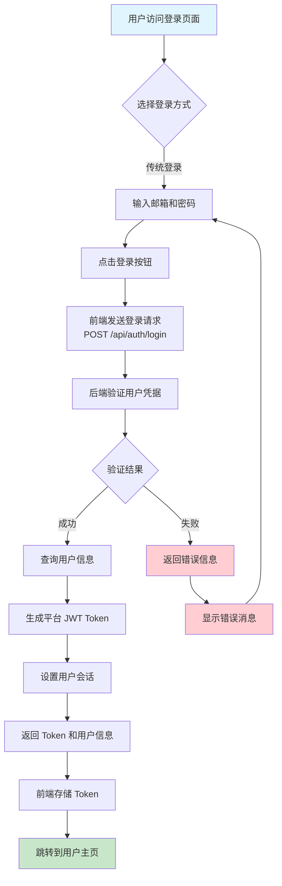
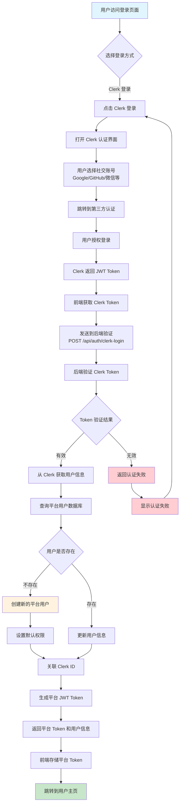
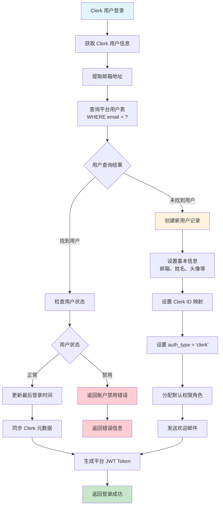
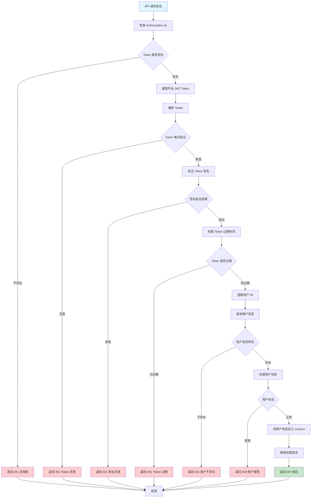
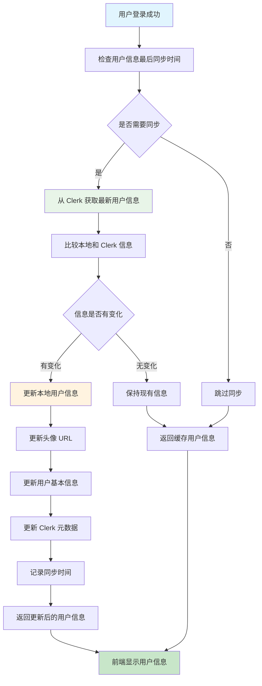
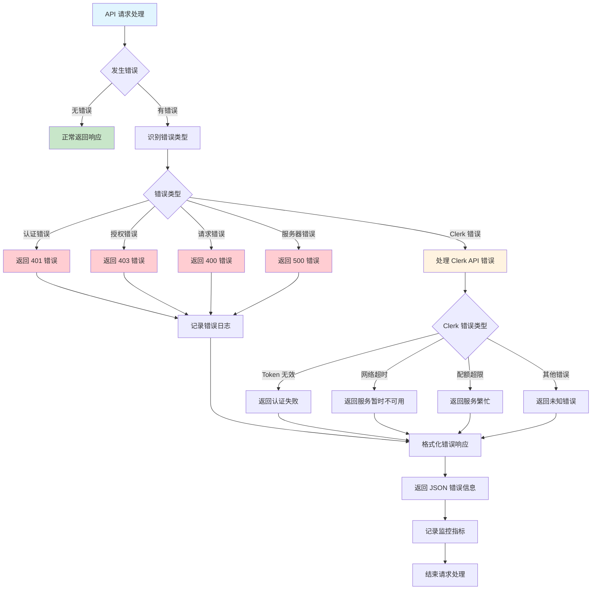
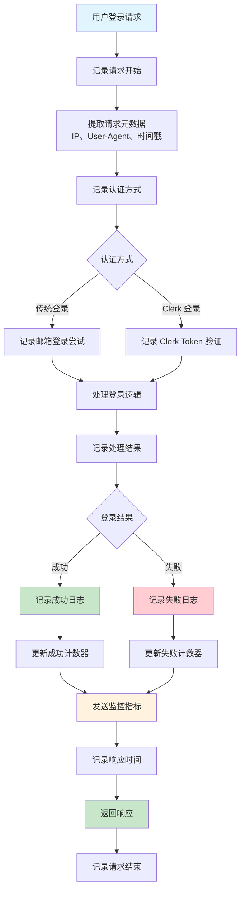

# 认证流程图

## 🔄 传统登录流程图



## 🔐 Clerk 登录流程图



## 🗂️ 用户数据映射流程图



## 🔗 账户关联流程图

```mermaid
flowchart TD
    A[用户登录平台账号] --> B[进入账户设置页面]
    B --> C[点击"关联社交账号"]
    C --> D[选择要关联的平台]
    D --> E[跳转到 Clerk 认证]
    E --> F[用户完成社交登录]
    F --> G[获取 Clerk Token]
    G --> H[发送关联请求<br/>POST /api/auth/link-account]
    H --> I[验证 Clerk Token]
    I --> J[获取 Clerk 用户信息]
    J --> K[检查邮箱是否匹配]
    K --> L{邮箱匹配结果}
    L -->|匹配| M[更新用户记录]
    L -->|不匹配| N[返回邮箱不匹配错误]
    M --> O[设置 auth_type = 'linked']
    O --> P[保存 Clerk ID 映射]
    P --> Q[同步用户信息]
    Q --> R[返回关联成功]
    N --> S[显示错误信息]

    style A fill:#e1f5fe
    style R fill:#c8e6c9
    style S fill:#ffcdd2
    style N fill:#ffcdd2
    style M fill:#fff3e0
```

## 🛡️ Token 验证中间件流程图



## 🔄 用户信息同步流程图



## 🚨 错误处理流程图



## 📊 监控和日志流程图



这些流程图详细展示了混合认证架构的各个关键环节，包括：

1. **传统登录流程** - 用户名密码认证的完整过程
2. **Clerk 登录流程** - 第三方社交登录的详细步骤
3. **用户数据映射** - Clerk 用户与平台用户的关联逻辑
4. **账户关联** - 现有用户绑定社交账号的流程
5. **Token 验证** - 中间件验证平台 JWT 的完整过程
6. **信息同步** - 用户信息的实时同步机制
7. **错误处理** - 各种错误情况的处理流程
8. **监控日志** - 系统监控和日志记录的完整流程

每个流程图都用不同颜色标识了成功路径（绿色）、失败路径（红色）和特殊处理路径（橙色），便于理解和实施。