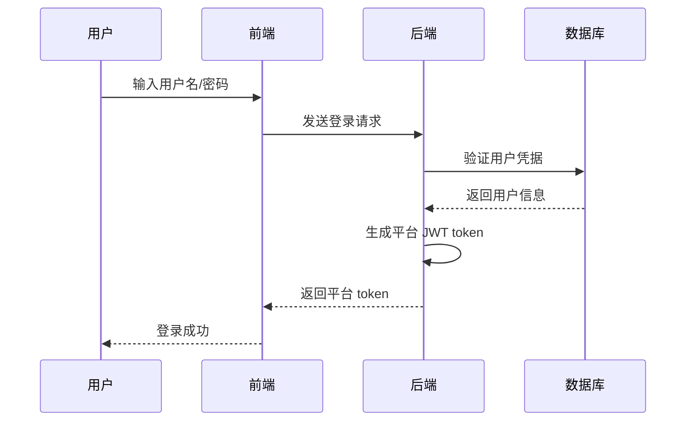
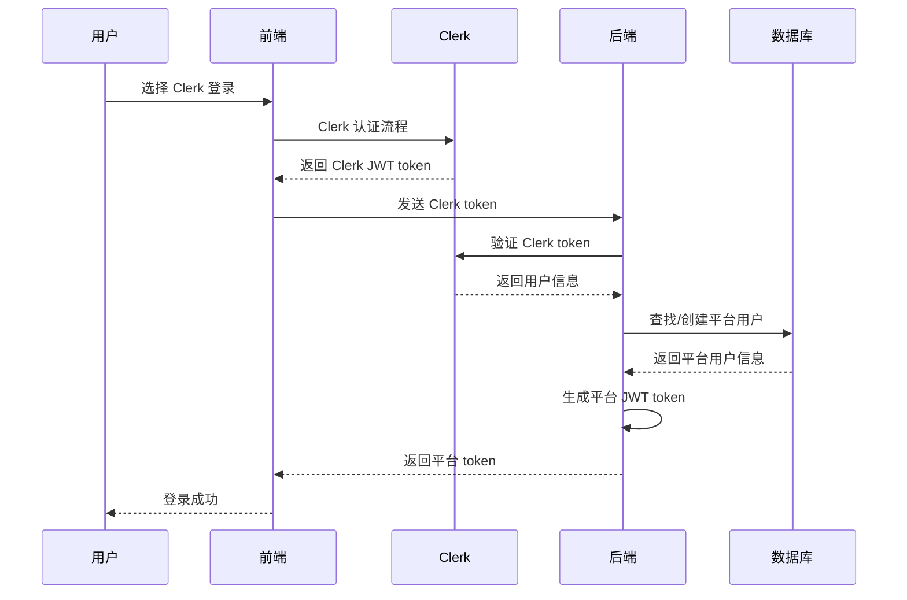

# Clerk 集成方案：混合认证架构

## 📋 方案概述

本方案采用**混合认证架构**，在保留现有账号/密码登录系统的同时，集成 Clerk 提供的第三方社交登录功能。核心思路是：无论用户通过哪种方式登录，最终都获得平台自身维护的统一 token。

## 🎯 核心设计理念

### **双轨制认证**
- **传统登录**：用户名/密码 → 平台 token
- **Clerk 登录**：Clerk 认证 → 验证 Clerk token → 生成平台 token

### **统一用户体验**
- 前端无需区分认证来源
- 统一的 token 格式和权限验证
- 一致的会话管理机制

## 🔄 认证流程

### 传统登录流程


### Clerk 登录流程


## 🛠️ 技术实现方案

### 1. 用户映射策略

#### 数据库设计
```sql
-- 扩展现有用户表
ALTER TABLE users ADD COLUMN clerk_id VARCHAR(255) UNIQUE;
ALTER TABLE users ADD COLUMN auth_type ENUM('legacy', 'clerk', 'linked') DEFAULT 'legacy';
ALTER TABLE users ADD COLUMN clerk_metadata JSON;

-- 索引优化
CREATE INDEX idx_users_email ON users(email);
CREATE INDEX idx_users_clerk_id ON users(clerk_id);
```

#### 用户关联逻辑
- **主键映射**：使用 email 作为唯一关联标识
- **自动创建**：Clerk 用户首次登录时自动创建平台账户
- **账户类型**：`legacy`(传统)、`clerk`(Clerk创建)、`linked`(已关联)

### 2. API 端点设计

#### 传统登录端点（保持不变）
```
POST /api/auth/login
Content-Type: application/json

{
  "email": "user@example.com",
  "password": "password123"
}

Response:
{
  "token": "platform_jwt_token",
  "user": { ... }
}
```

#### Clerk 登录端点（新增）
```
POST /api/auth/clerk-login
Content-Type: application/json

{
  "clerk_token": "eyJhbGciOiJSUzI1NiIs...",
  "frontend_info": { ... }
}

Response:
{
  "token": "platform_jwt_token",
  "user": { ... },
  "is_new_user": false
}
```

### 3. 后端处理逻辑

#### Clerk Token 验证 & 用户创建
```go
// 伪代码示例
func HandleClerkLogin(w http.ResponseWriter, r *http.Request) {
    // 1. 验证 Clerk token
    clerkUser, err := clerkClient.VerifyToken(clerkToken)

    // 2. 查找平台用户
    user, err := userRepo.FindByEmail(clerkUser.Email)

    // 3. 用户不存在则创建
    if user == nil {
        user = &User{
            Email:     clerkUser.Email,
            Name:      clerkUser.Name,
            ClerkID:   clerkUser.ID,
            AuthType:  "clerk",
            CreatedAt: time.Now(),
        }
        user = userRepo.Create(user)
    }

    // 4. 更新 Clerk 信息
    if user.ClerkID != clerkUser.ID {
        user.ClerkID = clerkUser.ID
        user.AuthType = "linked"
        userRepo.Update(user)
    }

    // 5. 生成平台 token
    platformToken := generatePlatformJWT(user)

    // 6. 返回响应
    json.NewEncoder(w).Encode(map[string]interface{}{
        "token": platformToken,
        "user": user,
        "is_new_user": user.CreatedAt.After(time.Now().Add(-time.Minute)),
    })
}
```

### 4. 前端集成方案

#### 登录界面设计
```jsx
// 伪代码示例
function LoginPage() {
    const [loginMethod, setLoginMethod] = useState('traditional');

    const handleClerkLogin = async () => {
        // 1. Clerk 认证
        const clerkToken = await clerk.signIn();

        // 2. 发送到后端
        const response = await fetch('/api/auth/clerk-login', {
            method: 'POST',
            headers: { 'Content-Type': 'application/json' },
            body: JSON.stringify({ clerk_token: clerkToken })
        });

        // 3. 获取平台 token
        const { token, user } = await response.json();

        // 4. 存储 token（与传统登录相同）
        localStorage.setItem('token', token);
        setCurrentUser(user);
    };

    return (
        <div>
            <Tabs value={loginMethod} onChange={setLoginMethod}>
                <Tab label="传统登录">
                    <TraditionalLoginForm />
                </Tab>
                <Tab label="社交登录">
                    <ClerkSignIn onSignIn={handleClerkLogin} />
                </Tab>
            </Tabs>
        </div>
    );
}
```

## 🔒 安全考虑

### 1. Token 管理
- **平台 Token**：采用现有的 JWT 生成和验证逻辑
- **Clerk Token**：仅用于一次性验证，不存储
- **过期策略**：平台 token 使用现有的过期时间

### 2. 权限控制
- **新用户权限**：Clerk 新用户设置默认权限等级
- **权限继承**：关联账户后继承原有权限
- **权限隔离**：不同认证方式的权限验证逻辑统一

### 3. 数据安全
- **敏感信息**：密码等敏感信息仅存储在平台数据库
- **元数据同步**：定期同步 Clerk 用户头像等信息
- **审计日志**：记录 Clerk 登录和账户创建事件

## 📊 实施计划

### 阶段一：基础集成（2-3 周）
- [ ] 实现 Clerk token 验证逻辑
- [ ] 建立用户映射和创建机制
- [ ] 新增 `/api/auth/clerk-login` 端点
- [ ] 前端集成 Clerk 登录组件

### 阶段二：功能完善（1-2 周）
- [ ] 实现用户信息同步机制
- [ ] 添加账户绑定功能
- [ ] 完善错误处理和日志记录
- [ ] 性能优化和缓存策略

### 阶段三：体验优化（1 周）
- [ ] 新用户引导流程
- [ ] 账户管理界面
- [ ] 数据分析和监控
- [ ] 文档和测试完善

## 🎯 方案优势

### 1. 向后兼容性
- ✅ 现有用户无需任何改变
- ✅ 现有 API 和业务逻辑完全不变
- ✅ 数据库结构无需大规模重构

### 2. 安全架构
- ✅ 平台 token 作为内部信任凭证
- ✅ 减少对第三方服务的依赖风险
- ✅ 统一的权限控制体系

### 3. 用户体验
- ✅ 统一的登录体验
- ✅ 前端无需区分认证来源
- ✅ 一致的会话管理

### 4. 开发效率
- ✅ 复用现有 token 生成逻辑
- ✅ 最小化代码变更
- ✅ 降低测试和部署复杂度

## 🔧 技术栈

- **后端**：Go + Gin/Echo 框架
- **前端**：React/Vue + Clerk SDK
- **数据库**：MySQL/PostgreSQL
- **认证**：JWT + Clerk SDK
- **缓存**：Redis（可选）

## 📈 监控指标

### 业务指标
- Clerk 登录成功率
- 新用户注册转化率
- 账户绑定完成率
- 登录方式分布统计

### 技术指标
- API 响应时间
- Token 验证成功率
- 数据库查询性能
- 错误日志监控

## 🚀 未来扩展

### 1. 多第三方登录
- Google、GitHub、微信等
- 统一的用户映射机制
- 灵活的认证策略配置

### 2. 高级功能
- 多因素认证（MFA）
- 单点登录（SSO）
- 企业级身份管理

### 3. 数据分析
- 用户行为分析
- 登录路径优化
- 个性化推荐

---

这个方案在保持系统稳定性的同时，为用户提供了更丰富的登录选择，是一个平衡性极佳的实施方案。